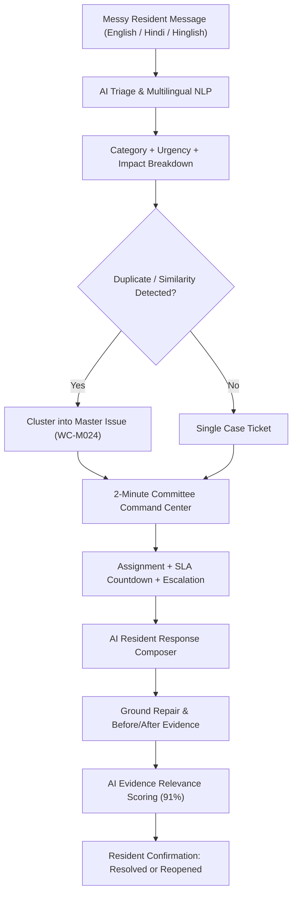
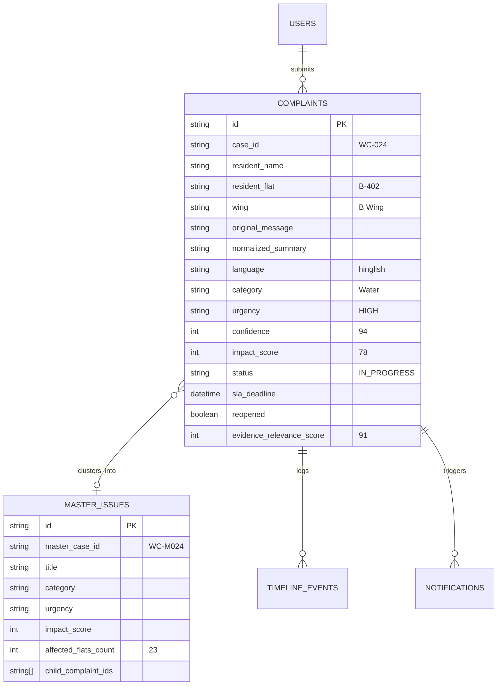

# SHIKAYAT BOX
### Society Issue Intelligence & Resolution Center
> **"Turn messy complaints into clear action."**

[](#)
[](#)
[](#)
[](#)

---

## 1. Product Overview

In high-density residential housing societies (~100 flats), managing maintenance and community complaints is fraught with friction:
- **Chaotic Resident Submissions:** Messages arrive across WhatsApp and chat in **English**, **Hindi (Devanagari)**, and **Hinglish** with typos, emotional phrasing, and missing details.
- **Buried Urgencies:** Serious emergencies (lift stoppages with elderly residents, sparking breaker panels, major water leaks) get buried under routine cleaning or parking gripes.
- **Overwhelmed Volunteers:** The Managing Committee comprises volunteers who typically have only **5 minutes per day** to triage issues.
- **Duplicate Explosion:** Multiple flats report the exact same failure (e.g., 7 flats complaining about water cuts in B Wing), creating duplicate tickets and fragmented tracking.

**SHIKAYAT BOX** transforms chaotic resident messages into prioritized, clustered Master Issues, assigns responsible owners, automates resident communication, enforces SLAs, and requires verified resolution evidence with resident sign-off.



---

## 2. Competition Demonstration Guide (2-Minute Judge Walkthrough)

To verify the end-to-end flow described in **Section 68 of the Product Specification**, follow these steps:

1. **Step 1 — Resident Submission:**
   - Go to **Report Issue**.
   - Click the 1-click test prompt: *"Lift B subah se band hai aur 7th floor pe elderly log hain."* (or speak into the 🎤 microphone).
   - Click **Analyze with AI**.
2. **Step 2 — AI Triage & Explanation:**
   - Observe the step-by-step sequence: `Understanding message` → `Detecting language (Hinglish)` → `Assessing urgency (HIGH)` → `Estimating impact (~18 flats)`.
   - Open **Why HIGH?** to inspect the user-facing decision factors (Essential building service, elderly residents on upper floor, medical context).
3. **Step 3 — Smart Confirmation:**
   - Click **Looks right — Submit**. Confetti triggers and ticket `WC-024` is registered.
4. **Step 4 — Society Command Center:**
   - Switch role to **Committee (Rohan Sharma)** from the top-right persona selector.
   - Go to **Command Center**.
   - Notice the **🔴 Attention Required** emergency banner with live remaining SLA countdown timer (`01:42:17 remaining`).
5. **Step 5 — Duplicate Clustering:**
   - Observe the banner: *"Possible existing issue detected: Water Supply — B Wing (7 related complaints, 23 affected flats)"*.
   - Click **Merge into master issue** to open **Master Issue WC-M024** and inspect the unified ticket.
6. **Step 6 — ⚡ 2-Minute Volunteer Triage:**
   - Click **⚡ 2-Min Triage** in the navbar to open the rapid-action deck for busy volunteers.
7. **Step 7 — Issue Intelligence & Response:**
   - Click any case to open the 3-panel deep dive.
   - Use the **AI Response Composer** to draft or translate an update in Hindi or Hinglish, then click **Send to Resident**.
8. **Step 8 — Verified Resolution Evidence:**
   - Click **Resolve & Upload Evidence**.
   - View the side-by-side **Before vs After** photos with **AI Evidence Relevance (91%)**. Click **Mark Verified**.
9. **Step 9 — Resident Verification & Reopen Workflow:**
   - Switch persona back to **Resident**.
   - Navigate to **Track Resolution Status**.
   - Test clicking **👎 Still happening**: Notice the ticket automatically reopens, priority escalates to **CRITICAL**, the committee is re-notified, and the audit timeline records the feedback!

---

## 3. Core Architecture & Tech Stack

| Layer | Technology | Rationale |
|---|---|---|
| **Frontend Framework** | React 19 + TypeScript | Strict type safety, high speed, and component modularity |
| **Build & Dev Tool** | Vite 8 | Instant HMR and sub-second production builds |
| **Styling & Design System** | Tailwind CSS | Warm off-white (`#FAF9F6`), electric violet (`#7C3AED`), status colors, JetBrains Mono numbers |
| **Icons** | Lucide React | Consistent, accessible civic UI symbols |
| **Backend API** | Node.js + Express + TypeScript (`tsx`) | Robust REST endpoints for triage, clustering, response composition, and SLA monitoring |
| **Database & Persistence** | Relational ACID JSON Store + Supabase compatibility | Foreign key relationships (`users`, `complaints`, `master_issues`, `notifications`), atomic writes, zero-config local boot |
| **AI Intelligence Layer** | Pluggable LLM (OpenAI / Gemini) + Advanced Built-in NLP Fallback | Works 100% reliably out of the box with zero external API key requirements, and automatically uses LLM when keys are provided |

---

## 4. Key Product Capabilities

### 🧠 1. Multilingual Natural Language Understanding
- Understands **English**, **Hindi (Devanagari)**, and colloquial **Hinglish** (e.g. *"paani nahi aa raha"*, *"subah se band"*, *"kisi ne slot block kiya"*, *"kooda nahi uthaya"*).
- Detects the resident's dialect and preserves raw text while generating a normalized English summary.

### 🎯 2. Low-Confidence Disambiguation (Section 17)
- If a complaint references multiple categories (e.g. *"Car parked near security gate blocked guard's view"*), confidence drops to ~54%.
- The system presents human override choices: `[Confirm Parking (54%)]` and `[Choose Security (46%)]` — ensuring humans retain oversight.

### 🛡️ 3. Failure Fallback Guarantee (Section 49)
- If the AI engine encounters a simulated failure or offline network, the application gracefully defaults to:
  - `Category: Other`
  - `Urgency: Medium`
  - `Status: Manual Review Required`
- The system **never crashes**.

### 🌌 4. Issue Galaxy Visualization (Section 24)
- An interactive SVG constellation with the Master Issue at the center and satellite flat nodes (`B-302`, `B-504`, `B-701`, `B-203`, `B-601`, `B-402`) in orbit. Hovering or clicking any node opens the complaint file.

### 🗺️ 5. Society Architectural Heatmap (Section 39)
- Stylized 4-Wing matrix (Wings A, B, C, D) across 7 floors with color-coded density dots (🟢 Normal, 🟡 Medium, 🟠 High, 🔴 Critical). Clicking any wing filters relevant issues.

### ⏱️ 6. Real-Time SLA Countdown & Escalation (Section 32 & 33)
- Live monospaced countdown timers (`01:42:17 remaining`).
- Auto-escalation triggers when deadlines are breached or nearing risk.

---

## 5. Demo Accounts

| Role | Name | Email | Default View |
|---|---|---|---|
| **Resident** | Mrs. Sunita Sharma | `resident@shikayatbox.demo` | Flat B-402 Smart Box & Tracking |
| **Committee Lead** | Rohan Sharma | `committee@shikayatbox.demo` | Society Command Center & Kanban |
| **Admin / Secretary** | Priya Nair | `admin@shikayatbox.demo` | Society Pulse & Audit History |

*Switch personas instantly using the persona switcher in the top-right corner of the Navbar.*

---

## 6. Installation & Quickstart

### Prerequisites
- Node.js `v18+` (Tested on `v24.14.1`)
- npm `v9+`

### Step 1: Install Dependencies
```bash
cd shikayat-box
npm install
```

### Step 2: Configure Environment (Optional)
The application works immediately out-of-the-box with its built-in NLP engine. To optionally connect external LLM providers:
```bash
cp .env.example .env
```
Fill in `.env`:
```env
PORT=3001
VITE_API_URL=http://localhost:3001/api
OPENAI_API_KEY=your_openai_api_key_here
GEMINI_API_KEY=your_gemini_api_key_here
```

### Step 3: Run Full-Stack Development
```bash
npm run dev
```
- **Web Frontend:** `http://localhost:5173`
- **Backend API:** `http://localhost:3001`

---

## 7. Database Schema & Entities

The application stores clean relational models:



---

## 8. Resetting Demo Data
At any point during evaluation or demonstration, click the **Reset Demo (🔄)** icon in the Navbar, or send a POST request:
```bash
curl -X POST http://localhost:3001/api/demo/reset
```
This instantly re-seeds the dataset with 35+ realistic complaints in English, Hindi, and Hinglish.

---

## 9. Design System Compliance
- **Wordmark:** **SHIKAYAT** (slate-900) **BOX** (violet-600)
- **Palette:** Warm off-white (`#FAF9F6`), Deep Charcoal (`#0F172A`), Electric Violet (`#7C3AED`)
- **Status Colors:** Critical (Red), High (Orange), Medium (Amber), Low (Emerald)
- **Zero generic AI robot illustrations:** Focus on operational clarity, typography hierarchy, and immediate civic utility.

---

**SHIKAYAT BOX**  
*Turn messy complaints into clear action.*
